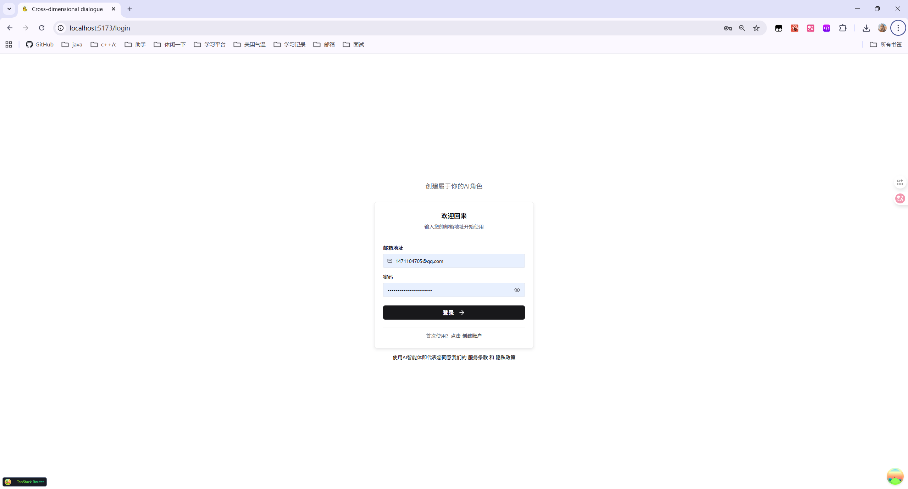
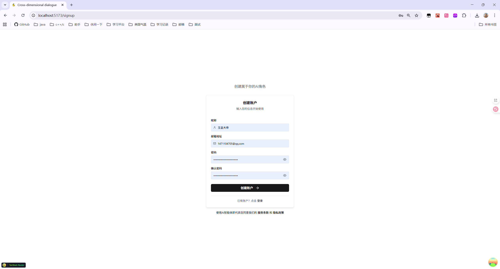
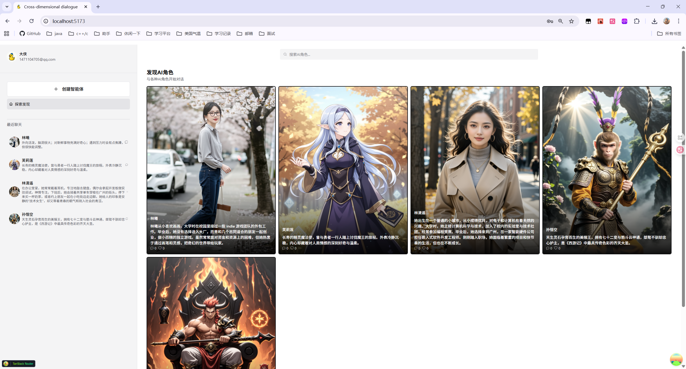
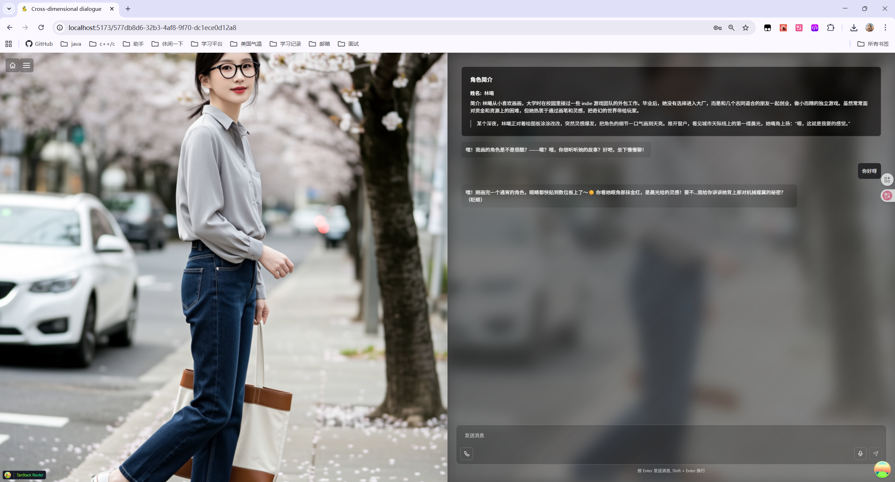
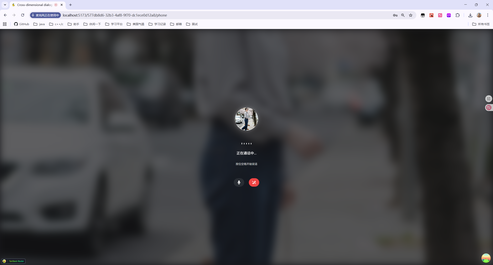
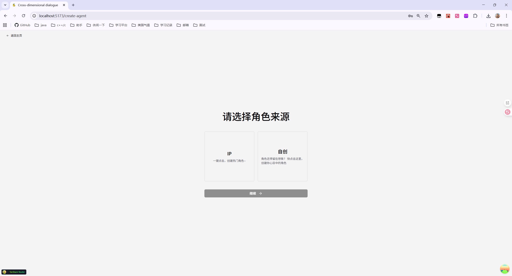
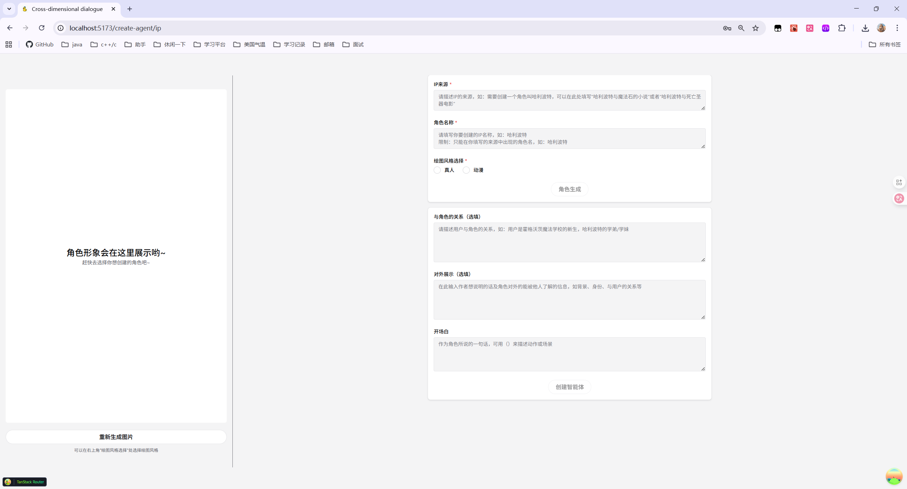
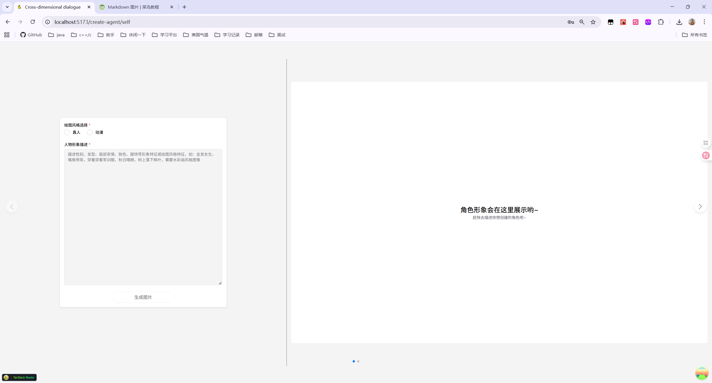
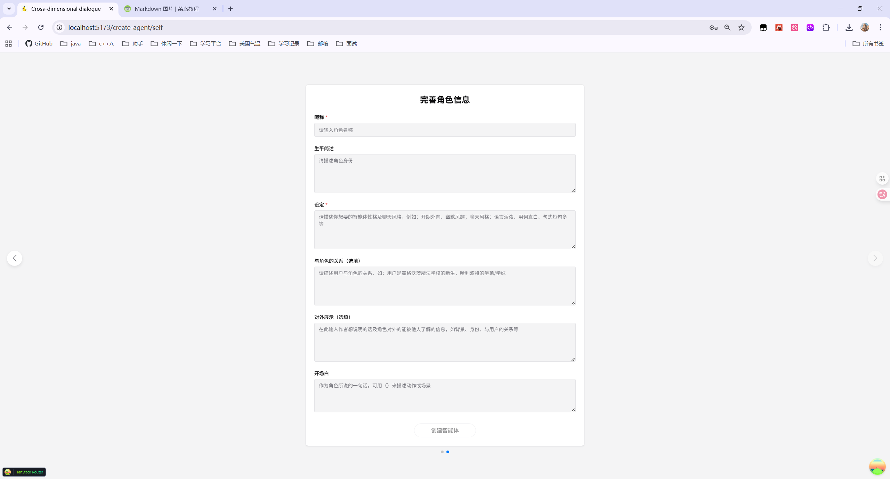

## Cross-dimensional dialogue（CCD）

为了创建出最符合人设的聊天型智能体，避免用户花费大量时间搜集角色设定，
一个面向“跨次元角色”的多模态对话与创作平台。CCD 通过 LLM 对话编排、语音合成/识别、图像生成与向量检索，为用户提供“像与角色在同一维度交流”的沉浸式体验。
### 项目展示

这是用户的登录页面，输入用户名和密码，点击登录按钮，即可进入聊天页面。


这是用户的注册页面，输入用户名和密码，点击注册按钮，即可注册成功。


这是主页，用户可以在这里创建角色，并开始对话。


这是对话页面，用户可以在这里与角色进行对话，打电话，发语音。


这是电话页面，用户可以在这里与角色进行电话。


可以选择ip创建和自创创建进行创建。


ip创建角色页面。


自创创建角色形象页面，通过描述角色形象，生成角色形象图片。


自创创建角色页面,通过填写角色详细的设定去生成角色。

### 主要特性

- **多模态交互**：文本对话、TTS 合成、STT 识别、图像生成与展示。
- **对话编排**：内置对话编排服务，支持上下文管理与多轮对话状态维护。
- **角色系统**：角色创建、画像、知识嵌入，支持自定义人设与素材。
- **向量检索**：使用 pgvector 存储与检索嵌入，提升检索增强生成（RAG）效果。
- **异步任务**：基于 Redis + RQ 的队列执行与结果跟踪。
- **可插拔模型**：支持通义千问（默认）与 DeepSeek，可扩展到其他厂商。
- **存储与分发**：集成七牛云对象存储与 CDN，加速音频/图片访问。
- **完善的前端体验**：React + Chakra UI + TanStack Router/Query，支持深色模式。
- **工程化**：Docker Compose、健康检查、Sentry、JWT 鉴权、邮件找回、E2E 测试。

### 技术栈

- **后端**：FastAPI、SQLModel、Pydantic、Alembic、PostgreSQL（pgvector）、Redis、RQ
- **前端**：React、TypeScript、Vite、Chakra UI、TanStack Router/Query
- **测试**：Pytest、Playwright
- **部署**：Docker Compose、Traefik（可选，生产 HTTPS）

## 系统架构概览

- `backend`：FastAPI 服务，提供 REST API 与 OpenAPI 文档，挂载前缀为 `/api/v1`。
- `worker`：RQ 任务执行进程，处理耗时的生成与编排任务。
- `frontend`：SPA 前端仪表盘与聊天界面。
- `db`：PostgreSQL + pgvector，存储业务数据与向量嵌入。
- `redis`：消息队列与缓存。
- `traefik`（可选生产）：反向代理与证书自动化。

健康检查：`GET http://localhost:8000/api/v1/utils/health-check/`

OpenAPI 文档：`http://localhost:8000/api/v1/docs`

系统详细设计见：`.backend/docs/system-design.md`

## 快速开始

### 方式一：Docker 一键启动（本地）

1. 准备环境：安装 Docker 与 Docker Compose。
2. 在项目根目录创建 `.env`（最少变量见下文“环境变量”）。
3. 启动开发编排：

```bash
docker compose -f docker-compose.override.yml up -d --build
```

- 后端：`http://localhost:8000`
- 前端（容器方式）：`http://localhost:5173`
- Adminer（可选，数据库管理）：`http://localhost:8080`

说明：`docker-compose.override.yml` 开启调试、自动重载与本地可视化面板（Traefik 仪表盘 `http://localhost:8090`）。

### 方式二：本地前端开发 + 容器后端（推荐）

1. 使用上方 Docker 命令启动后端与依赖。
2. 本机启动前端：

```bash
cd frontend
npm install
npm run dev
```

浏览器访问：`http://localhost:5173`

## 环境变量（.env 抽样）

以下为最小可用配置示例，请根据需要扩展。

你可以直接复制示例文件生成本地配置：

```powershell
# Windows PowerShell
Copy-Item .env.example .env
```

```bash
# macOS / Linux
cp .env.example .env
```

注意：后端会在非 `local` 环境下强制检查 `SECRET_KEY`、`POSTGRES_PASSWORD`、`FIRST_SUPERUSER_PASSWORD` 不得为默认值。

## API 与路由

后端统一前缀：`/api/v1`

- 认证：`/login/*`
- 用户：`/users/*`
- 角色：`/characters/*`
- 对话：`/conversations/*`
- 对话编排：`/dialogue-orchestration/*`
- 图像：`/image/*`
- 语音处理：`/voice-processing/*`
- 任务：`/tasks/*`
- 工具与示例：`/utils/*`, `/items/*`
- 私有路由（仅本地环境）：`/private/*`

示例：健康检查 `GET /api/v1/utils/health-check/`

## 任务队列与异步处理

- 队列：Redis（`redis://...`）
- 执行器：RQ Worker（容器 `worker`）
- 配置：`TASK_*` 变量（默认超时、重试、结果与失败 TTL、并发数量等）

启动后可在后端接口或业务服务中投递任务，Worker 将异步消费。

## 数据与嵌入

- 数据库：PostgreSQL
- 向量检索：pgvector（嵌入模型默认使用通义千问 `text-embedding-v4`）
- 缓存: Redis 

## 前端开发

- 技术栈：React + TypeScript + Vite + Chakra UI + TanStack Router/Query
- 使用 `pnpm i` 进行环境配置
- 本地启动：`pnpm run dev`（默认使用 `VITE_API_URL=http://localhost:8000`）
- 生产构建：`npm run build`，容器镜像由 `frontend/Dockerfile` 构建

## 后端开发
- 技术栈：FastAPI + Pydantic + SQLAlchemy + Alembic + Redis + RQ + pgvector
- 使用 `.env` 进行环境配置
- 使用 `uv sync` 下载依赖环境
- 运行 `docker compose up db redis` 启动环境
- 本地启动：
```shell
cd backend
fastapi dev
```
- worker 启动, 新开一个终端：
```
cd backend
python start_worker.py
```

## 常见问题（FAQ）

1. 你计划将这个网页面向什么类型的用户？这些类型的用户他们面临什么样的痛点，你设想的用户故事是什么样呢？
   1. 类型一：面向需要情感陪伴的有喜欢的名人、影视动漫角色或小说人物的用户。
      1. 这类用户面临的痛点一：现在市面上的多数AI角色扮演软件无法真实的还原角色的人设。
         1. 原因：角色的人设通常是在创建智能体的时候由创作者来进行描述的。但创作者所进行的描述基本上都会带有创作者的个人色彩及想法，并不能很高的还原真实的影视动漫或者历史人物的人设性格。这就造成了很多喜欢影视动漫角色的人找不到与自己喜欢的角色对话的窗口。
      2. 这类用户面临的痛点二：并不是每一个想创建自己喜欢的角色的智能体的用户都有时间和精力去总结自己喜欢的角色的人设。
         1. 原因：现在市面上的大多数AI角色扮演软件都是由创作者自行进行角色人设的书写设定。这也就导致了某些喜欢这也就导致了某些想要创建自己喜欢的角色的用户。必须得对角色的生平进行一个概括才可以。达到角色创建出来符合人设的要求。但往往并不是每一个用户都有时间和精力去做这件事情，所以我们这边
      3. 用户故事：
         1.    小a喜欢动漫《葬送的芙莉莲》里面的主角芙莉莲，她希望和芙莉莲展开一场跨时空的对话，她想问问芙莉莲有没有意识到勇者辛美尔未说出口的爱。

         2.    小a尝试同许多AI角色扮演软件里面的芙莉莲进行对话，但她发现这些ai形象的人物性格和故事设定同动漫中的芙莉莲有很多差别。

         3.    于是小a决定自己创建一个芙莉莲的ai智能体，但目前市面上大部分AI角色扮演软件的创建智能体功能必须要用户自己来书写角色的人设。但小a也无法精准的概括出芙莉莲的人设，她只是被芙莉莲慵懒平淡的处事方式和外冷内热的性格特质吸引从而延伸到喜欢。

         4.    小a就这样怀揣着疑惑直到登陆了我们的ai角色扮演网站。小a从网站主页点进哈利波特的聊天页面，发现聊天时哈利波特的人设非常贴合原著。于是退出聊天页面去搜索‘芙莉莲’这个角色，但小a没有搜到芙莉莲。

         5.    小a打算在这个网站再次尝试创建芙莉莲的ai智能体。小a进入智能体创建页面之后，发现有专门针对影视动漫等人物角色的智能体创建页面。而且这个页面不需要小a自己写芙莉莲的角色设定，只需要输入角色来源及角色名称就可以获得符合动漫中人设的芙莉莲的ai智能体。

         6.    小a在和自己创建的芙莉莲ai智能体聊天后终于获得了以她满意的答案。
   2. 类型二：面向需要情感陪伴的自带角色设定的用户。
      1. 这类用户面临的痛点：无法与自己创造的角色进行沟通。
         1. 原因：有一部分人会创建一个或多个虚拟角色作为自己的自设或友人，但这种虚拟角色通常以文字或者是绘画的形式展现，并不能像真正存在的人一样与真实世界的人进行交流。
      2. 用户故事：
      3.   小b有一个“跨次元”的朋友——cc。

      4.   小b误入绘圈拍设子现场，一眼就相中了cc，并高价将cc带回家，从此，小b就有了一个跨次元的朋友。

      5.   小b为了更了解cc，请多位绘圈大佬画下cc的日常生活，但久而久之，小b不再满足于纸面上冷冰冰的cc，她开始想和cc进行真人般的对话。

      6.   转折点就在小b了解到AI角色扮演网站之后，小b将cc的形象上传并输入烂熟于心的cc的设定，创建了一个专属于自己的cc智能体，次元壁被打破，小b和自己的cc终于畅快的聊上了天。

      7.   这一次，不再是小b的单方面付出，而是小b和cc的双向奔赴。
   3. 类型三：面向需要情感陪伴的少社交或无社交型用户。
      1. 这类用户面临的痛点：一个人待着很寂寞，需要与有社交性质的聊天和陪伴。
      2. 用户故事：
      3.   最近，E女士觉得自己很寂寞，E女士想在下班之后与人聊天。

      4.   E女士是一名职场新人，她今年刚刚毕业，背井离乡在另一个全新的城市生活。

      5.   这个城市风景秀丽人文风气良好，但由于E女士刚刚到来，还无法很好的融入集体，所以还没有可以下班后进行聊天的朋友。

      6.   转折点在E女士打开AI角色扮演网站之后，E女士在网站主页上看到了很多可以聊天的智能体，看着网页精美的配图，E女士点进一位名叫dd的智能体的聊天页面，E女士同dd聊得很好，她很喜欢这种有来有回的对话质感。

      7.   E女士将自己的日常生活，小烦恼小困惑说给dd听，dd也会很认真的回复她，并且也会给E女士分享自己的日常生活。偶尔，dd会在E女士打开网页后给E女士主动发消息或者打电话，dd成了E女士的情感寄托，E女士自此每天下班之后都会和dd聊天。
2. 你认为这个网页需要哪些功能？这些功能各自的优先级是什么？你计划本次开发哪些功能？
   1. 我认为这个网页需要的功能：
      1. P0级：创建智能体功能、AI聊天功能、对角色进行搜索的功能、查看创建的智能体的功能、查看聊过的智能体功能、查看用户与智能体的聊天记录的功能、编辑个人信息的功能
      2. P1级：剧情互动功能
      3. P2级：反馈功能、产品级AI助理功能、管理员对用户和智能体进行审核/删除的功能
      4. P3级：对用户进行搜索的功能、对智能体创作者进行关注/分享的功能、智能体创作者主页展示的功能、查看关注的创作者的功能、对智能体进行点赞/关注/评论/分享的功能、查看赞过/关注的智能体的功能
      5. 其他：供用户发帖/交友的社区功能、多角色拉群功能、世界书创建多个角色的功能等
   2. 我计划本次开发的功能：P0级功能
      1. 对P0功能的解释：分为两大类，一类是用户功能，一类是AI聊天功能。用户功能，包括角色搜索功能、创建智能体功能、查看创建的智能体的功能、查看聊过的智能体的功能、查看聊过智能体的聊天记录的功能、编辑个人信息的功能；AI聊天功能做细分就是AI智能体回复的功能以及用户输入的功能，我们这边还拓展了电话的功能。
3. 你计划采纳哪家公司的哪个 LLM 模型能力？你对比了哪些，你为什么选择用该 LLM 模型？
   1. 我们计划采纳阿里云的通义千问模型能力。
   2. 对比：
      1. GPT-4（OpenAI）：具备极强的跨语言对话能力和复杂语境理解能力，在多轮深度对话、创意性对话中表现突出，生成的回复逻辑连贯性和内容丰富度较高。但 API 调用成本昂贵，国内访问需依赖特殊网络环境，存在稳定性风险，且对中文本土文化、行业特定场景的适配不如通义千问贴合。
      2. 文心一言（百度）：同样深耕中文对话领域，在通用对话和部分垂直行业场景中适配良好，与百度生态产品的联动性强。不过在长对话的上下文记忆能力、复杂逻辑对话的推导准确性上，与通义千问相比，对部分细分对话场景的优化稍显不足，且高并发场景下的资源调度灵活性略逊于阿里云体系。
      3. 通义千问（阿里云）：作为阿里云自主研发的大语言模型，对中文语境和国内用户需求适配度极高，尤其在日常对话、行业场景化对话中，能精准理解中文语义逻辑与文化背景，且国内访问延迟低、稳定性强，依托阿里云的云计算资源，在高并发对话场景下仍能保持流畅响应。同时，其提供的 API 接口文档完善，与国内开发者生态兼容性好，后期技术支持与服务对接更便捷。不过在处理国际多语言对话或部分小众领域的深度专业对话时，知识覆盖的广度和灵活性略逊于部分国际模型。
   3. 采纳原因：
      1. 产品核心需求聚焦于对话功能，且目标用户大概率以国内群体为主，通义千问在中文对话的适配性、国内访问的稳定性与低延迟上具备天然优势，能确保用户在日常闲聊、场景化对话中获得流畅、贴合需求的交互体验。同时，依托阿里云成熟的云计算基础设施，可有效应对对话场景中的高并发需求，避免因服务器负载问题影响对话体验；此外，阿里云的本土化技术支持与完善的开发者生态，能降低后期接口对接、功能迭代的成本，减少技术沟通壁垒。尽管在国际多语言对话等少数场景中存在局限，但对于以国内用户为核心、以优质中文对话为目标的需求而言，通义千问是兼顾体验、成本与稳定性的最优选择。
4. 你期望 AI 角色除了语音聊天外还应该有哪些技能？
   1. 角色根据人设衍生出来的强人设专属技能，如哈利波特魔法课程全解技能、苏格拉底哲学引导技能等。
   2. 用户打开网站后，角色主动给用户打电话/打招呼（发消息）的技能。
   3. 角色给用户分享自己的日常生活的技能。
   4. 角色识别用户情感并给用户回复表情包的技能。
   5. 用户带上VR设备可以与AI角色进行交互的技能。
   6. 控制软件的技能：AI角色帮用户建模、查询天气、记账等技能。
   7. 控制硬件的技能：AI角色与生活设施如电视、台灯、机器人等链接的技能。
   8. 教学技能，如作诗、教绘画等。


## 许可证

本项目遵循 MIT 协议。详见 `LICENSE`。
