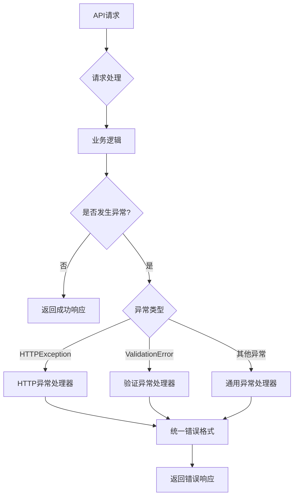

# API 统一返回数据规范

## 概述

本项目实现了统一的API返回数据格式和全局异常处理机制，确保所有API接口都遵循相同的响应规范，提供一致的用户体验。

## 响应格式规范

### 统一响应结构

所有API接口都使用以下统一的响应格式：

```json
{
  "code": 0,           // 状态码
  "msg": "ok",         // 消息描述
  "data": {...}        // 响应数据
}
```

### 字段说明

| 字段 | 类型 | 必填 | 说明 |
|------|------|------|------|
| `code` | integer | 是 | 状态码，0表示成功，>0表示错误 |
| `msg` | string | 是 | 消息描述，成功或错误的说明 |
| `data` | any | 否 | 响应数据，成功时包含具体数据，错误时通常为null |

## 状态码规范

### 成功状态码

| 状态码 | 说明 | 使用场景 |
|--------|------|----------|
| 0 | 成功 | 操作成功完成 |

### 错误状态码

| 状态码 | HTTP状态码 | 说明 | 使用场景 |
|--------|------------|------|----------|
| 1 | 500 | 通用错误 | 未分类的错误 |
| 400 | 400 | 请求参数错误 | 参数格式错误、业务逻辑错误 |
| 401 | 401 | 未授权 | 未登录或token无效 |
| 403 | 403 | 权限不足 | 无权限访问资源 |
| 404 | 404 | 资源未找到 | 请求的资源不存在 |
| 422 | 422 | 数据验证失败 | 请求数据不符合验证规则 |
| 500 | 500 | 服务器内部错误 | 系统内部错误 |

## 响应示例

### 成功响应

#### 获取角色列表
```json
{
  "code": 0,
  "msg": "获取角色列表成功",
  "data": {
    "characters": [
      {
        "id": "uuid-string",
        "name": "角色名称",
        "short_bio": "角色简介",
        "persona_text": "角色人格定义",
        "is_active": true,
        "created_at": "2025-01-01T00:00:00Z",
        "updated_at": "2025-01-01T00:00:00Z"
      }
    ],
    "total": 10,
    "skip": 0,
    "limit": 100
  }
}
```

#### 创建角色
```json
{
  "code": 0,
  "msg": "角色创建成功",
  "data": {
    "id": "uuid-string",
    "name": "新角色",
    "short_bio": "角色简介",
    "persona_text": "角色人格定义",
    "is_active": true,
    "created_at": "2025-01-01T00:00:00Z",
    "updated_at": "2025-01-01T00:00:00Z"
  }
}
```

### 错误响应

#### 资源未找到
```json
{
  "code": 404,
  "msg": "角色未找到",
  "data": null
}
```

#### 业务逻辑错误
```json
{
  "code": 400,
  "msg": "角色名称已存在",
  "data": null
}
```

#### 权限不足
```json
{
  "code": 403,
  "msg": "权限不足",
  "data": null
}
```

#### 数据验证失败
```json
{
  "code": 422,
  "msg": "请求参数验证失败",
  "data": {
    "errors": [
      {
        "field": "name",
        "message": "角色名称不能为空",
        "type": "value_error.missing"
      },
      {
        "field": "short_bio",
        "message": "角色简介长度不能超过500个字符",
        "type": "value_error.any_str.max_length"
      }
    ]
  }
}
```

#### 服务器内部错误
```json
{
  "code": 500,
  "msg": "服务器内部错误，请稍后重试",
  "data": null
}
```

## 全局异常处理

### 异常处理机制

系统自动捕获并处理以下类型的异常：

1. **HTTPException**: FastAPI的HTTP异常
2. **RequestValidationError**: 请求参数验证异常
3. **ValidationError**: Pydantic数据模型验证异常
4. **Exception**: 其他未捕获的异常

### 异常处理流程



## 开发指南

### 在路由中使用统一响应

#### 成功响应
```python
from app.utils.response import success_response

@router.get("/characters/{character_id}")
def get_character(character_id: uuid.UUID):
    character_obj = character.get(db, id=character_id)
    if not character_obj:
        return not_found_response(resource="角色")
    
    return success_response(
        data=character_obj, 
        msg="获取角色详情成功"
    )
```

#### 错误响应
```python
from app.utils.response import error_response, not_found_response

@router.post("/characters/")
def create_character(character_in: CharacterCreate):
    # 检查角色名称是否已存在
    existing_character = character.get_by_name(db, name=character_in.name)
    if existing_character:
        return error_response(msg="角色名称已存在", code=400)
    
    character_obj = character.create(db, obj_in=character_in)
    return success_response(data=character_obj, msg="角色创建成功")
```

### 便捷函数

系统提供了以下便捷函数：

| 函数名 | 说明 | 参数 |
|--------|------|------|
| `success_response()` | 成功响应 | `data`, `msg`, `code` |
| `error_response()` | 错误响应 | `msg`, `code`, `data` |
| `not_found_response()` | 资源未找到 | `resource`, `msg` |
| `unauthorized_response()` | 未授权 | `msg` |
| `forbidden_response()` | 权限不足 | `msg` |
| `server_error_response()` | 服务器错误 | `msg` |

### 自定义响应

如果需要自定义响应格式，可以直接使用 `APIResponse` 类：

```python
from app.utils.response import APIResponse

# 自定义成功响应
response = APIResponse.success(
    data={"custom": "data"},
    msg="自定义成功消息",
    code=0
)

# 自定义错误响应
response = APIResponse.error(
    msg="自定义错误消息",
    code=1001,
    data={"error_details": "详细信息"}
)
```

## 前端集成

### JavaScript/TypeScript 示例

```typescript
interface ApiResponse<T = any> {
  code: number;
  msg: string;
  data: T;
}

// 通用API请求函数
async function apiRequest<T>(url: string, options?: RequestInit): Promise<ApiResponse<T>> {
  const response = await fetch(url, {
    headers: {
      'Content-Type': 'application/json',
      ...options?.headers,
    },
    ...options,
  });
  
  const data: ApiResponse<T> = await response.json();
  
  if (data.code !== 0) {
    throw new Error(data.msg);
  }
  
  return data;
}

// 使用示例
try {
  const response = await apiRequest<{characters: Character[]}>('/api/v1/characters/');
  console.log('角色列表:', response.data.characters);
} catch (error) {
  console.error('请求失败:', error.message);
}
```

### React Hook 示例

```typescript
import { useState, useEffect } from 'react';

interface ApiResponse<T> {
  code: number;
  msg: string;
  data: T;
}

function useApi<T>(url: string) {
  const [data, setData] = useState<T | null>(null);
  const [loading, setLoading] = useState(true);
  const [error, setError] = useState<string | null>(null);

  useEffect(() => {
    fetch(url)
      .then(res => res.json())
      .then((response: ApiResponse<T>) => {
        if (response.code === 0) {
          setData(response.data);
        } else {
          setError(response.msg);
        }
      })
      .catch(err => setError(err.message))
      .finally(() => setLoading(false));
  }, [url]);

  return { data, loading, error };
}

// 使用示例
function CharacterList() {
  const { data, loading, error } = useApi<{characters: Character[]}>('/api/v1/characters/');
  
  if (loading) return <div>加载中...</div>;
  if (error) return <div>错误: {error}</div>;
  
  return (
    <div>
      {data?.characters.map(character => (
        <div key={character.id}>{character.name}</div>
      ))}
    </div>
  );
}
```

## 最佳实践

### 1. 错误处理
- 使用合适的错误码和错误消息
- 提供详细的验证错误信息
- 避免暴露敏感的系统信息

### 2. 成功响应
- 提供有意义的成功消息
- 包含必要的元数据（如分页信息）
- 保持数据结构的一致性

### 3. 前端集成
- 统一处理API响应格式
- 实现全局错误处理机制
- 提供用户友好的错误提示

### 4. 调试和监控
- 记录详细的错误日志
- 监控API响应状态
- 跟踪异常发生频率

## 更新日志

### v1.0.0 (2025-01-22)
- 实现统一API响应格式
- 添加全局异常处理机制
- 支持多种错误类型处理
- 提供便捷的响应函数
- 完善文档和示例

---

如有问题或建议，请联系开发团队。
